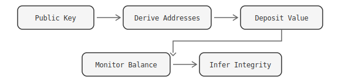
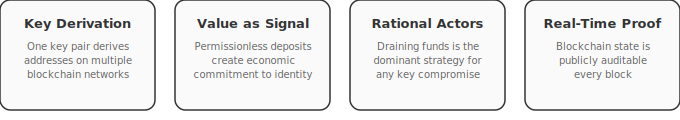
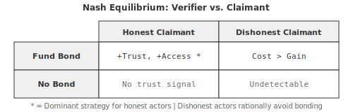
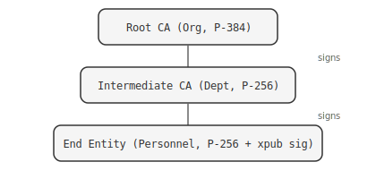
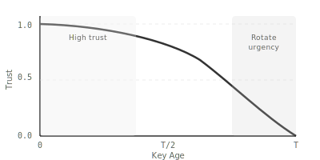

<p align="center">
  
</p>

<h1 align="center">Adversarial Security</h1>
<p align="center"><strong>Game-Theoretic Key Integrity Through Blockchain Economics</strong></p>
<p align="center"><em>A whitepaper on using cryptocurrency balances as real-time, permissionless proof of cryptographic key integrity.</em></p>

---

## Abstract

Traditional Public Key Infrastructure (PKI) relies on centralized Certificate Authorities (CAs) to establish trust. This model has been repeatedly undermined by breaches at RSA <sup>[1](#ref-1)</sup>, Microsoft <sup>[2](#ref-2)</sup>, DigiNotar, Symantec, and others <sup>[3](#ref-3)</sup>. This paper presents **Adversarial Security**, a game-theoretic trust model in which cryptocurrency balances at deterministically derived addresses serve as continuous, publicly verifiable proof of key integrity. The core insight is that a rational actor who compromises a private key will drain its associated funds immediately, because withdrawal is instant, irreversible, and risk-free. Undrained value therefore implies an uncompromised key. This transforms blockchain state into a live security signal: not a point-in-time certificate, but a continuous, permissionless trust metric.

---

## 1. Background

Secure identity management and data distribution typically rely on centralized providers. Users establish trust relationships through certificate chains based on digital signatures, depending on Root Certificate Authorities (CAs). However, this model has proven vulnerable to compromise. The abstract nature of these relationships makes security quantification difficult, depending on key creation costs, entity value, compromise likelihood, technology administration, and protected system value.

Compounding these structural problems is a **security labor misalignment**: the people most responsible for moving sensitive data and safeguarding cryptographic keys are often the lowest-paid members of an organization. The 2015 breach of the U.S. Office of Personnel Management (OPM) — which exposed the security-clearance background-investigation files of 21.5 million people — illustrates the consequences <sup>[4](#ref-4)</sup>. Contractors earning modest salaries administered systems whose compromise caused damage measured in billions of dollars and untold national-security harm. When the economic value attached to a key is abstract or invisible, organizations rationally under-invest in protecting it. Adversarial Security corrects this by making key value *concrete and visible*: attaching real funds to a key forces the custodial organization to protect those funds at parity with — or in proportion to — the value of the data that key secures. A key holding $10 million in cryptocurrency will not be administered by an underfunded IT team with default passwords; the economic incentive to protect the key scales automatically with the value at stake.

This model has fundamental weaknesses:

- **Single points of failure.** A compromised CA undermines every certificate it has issued.
- **Opaque trust.** The security of a CA's key management practices is not observable by relying parties.
- **Revocation lag.** Certificate Revocation Lists (CRLs) and OCSP introduce latency between compromise and detection, sometimes measured in weeks or months.
- **Abstract trust.** Security is qualitative, not quantitative. There is no way to measure how much trust a certificate deserves.

In 2009, Bitcoin emerged as a decentralized PKI system for peer-to-peer electronic cash <sup>[5](#ref-5)</sup>, secured by proof-of-work consensus operating at over 50,000 TH/s, making it "the most secure public PKI network ever created in terms of the amount of compute power required to break its security." Ethereum followed, enabling decentralized applications through smart contracts <sup>[6](#ref-6)</sup>. Cryptocurrency exchanges created markets establishing monetary value, allowing cryptographic principles to directly store value against keys without additional abstraction. This enabled more accurate security evaluation.

---

## 2. The Adversarial Trust Model

The system is called *Adversarial Security* because it deliberately recruits adversaries as the enforcement mechanism. Anyone can increase the trust level of — effectively paint a target on — any key they need to trust but currently don't. A hospital that must trust a medical-device vendor's signing key can unilaterally deposit funds to that key's derived addresses, raising the economic stakes of compromise without the vendor's permission. More critically, depositors can issue **public bounties**: by publishing the derived addresses alongside details about the key's purpose, custodial arrangements, and the schedule on which new funds will arrive, they invite the very actors most capable of compromise — hacker collectives, nation-state operators, organized crime — to attempt extraction. If those adversaries *cannot* drain the funds, the key's integrity is demonstrated against the most capable threat actors in the world. The name reflects this core inversion: security is not provided *despite* adversaries but *because of* them.

Instead of trusting an authority's *assertion* that a key is valid, observers verify a key's integrity by checking the *economic state* of its derived addresses. This approach contrasts with centralized CA models by allowing anonymous, permissionless trust level increases: entities can transfer funds to addresses without owner permission to signal confidence.

### 2.1 Core Mechanism

Cryptographic public keys used for signing can mathematically derive addresses on multiple blockchain networks via hierarchical deterministic (HD) derivation (BIP-32 <sup>[7](#ref-7)</sup>, BIP-44 <sup>[8](#ref-8)</sup>, SLIP-10 <sup>[9](#ref-9)</sup>). One key pair serves both authentication and value custody, requiring no additional infrastructure.

By depositing value at those derived addresses, a keyholder or any third party creates a **game-theoretic security bond**:

<p align="center">
  
</p>

The network operates on the principle that the security value of data signed by a key should equal or exceed the funds that key can access:

```
S(k) ≥ F(k)
```

Where `S(k)` is the security assurance level and `F(k)` is the fund value accessible by key `k`. Unspent funds suggest secure, uncompromised private keys.

### 2.2 Four Pillars

<p align="center">
  
</p>

1. **Key Derivation.** A public key used for signing data can mathematically derive addresses on multiple blockchain networks (BIP-32/44). One key pair serves both authentication and value custody, requiring no additional infrastructure.

2. **Value as Trust Signal.** Derived addresses are permissionless. Anyone can deposit funds to signal trust in a key. This enables both *self-bonding* (owner deposits) and *third-party bonding* (others deposit to signal confidence). The aggregate balance quantifies the economic cost of compromise.

3. **Rational Actor Assumption.** A compromised key gives the attacker access to both impersonation *and* fund withdrawal. Draining funds is the **dominant strategy**: it is immediate, irreversible, and carries zero marginal risk since the key is already compromised. Multiple adversaries with the same key create a race condition that accelerates drainage. Undrained value therefore implies no compromise.

4. **Real-Time Verification.** Blockchain state is publicly auditable and updates every block. This provides continuous, permissionless proof of key integrity. Any observer can independently verify the balance without trusting a certificate authority or revocation list.

### 2.3 Trust Quantification

Trust evaluation depends on three observable signals:

```
T(a) = f(W(a), V(a), D(a))
```

Where:
- **T(a)** = trust level of address `a`
- **W(a)** = web of trust score (network relationships and endorsements contribute to entity trustworthiness)
- **V(a)** = fund value at address (stored blockchain value indicates trust)
- **D(a)** = fund duration at address (duration of unspent funds implies private key security and integrity)

The duration component provides critical evidence. Funds that have remained at an address for extended periods demonstrate that the private key has not been compromised over that interval. Time provides an axis of security evidence that certificate-based systems cannot replicate.

---

## 3. Game Theory of the Security Bond

This section formalizes the incentive structures, strategic interactions, and equilibrium conditions underlying adversarial security. The security bond and associated rules are **mechanism design tools**: they create conditions where rational actors are incentivized toward honest behavior.

### 3.1 The Security Bond as a Commitment Device

The security bond functions as a **credible commitment mechanism**. By locking value across multiple blockchain networks, a keyholder signals:

- **Costly signaling.** Acquiring and holding assets across diverse networks is expensive. A well-funded bond is difficult to fake, making it a reliable signal of investment in the identity. This follows the **handicap principle** from signaling theory <sup>[10](#ref-10)</sup>: the cost of the signal is what makes it credible.
- **Skin in the game.** Value locked to derived addresses creates a direct economic loss if the associated private keys are compromised or the identity is used maliciously. This aligns with Nassim Taleb's asymmetry principle <sup>[11](#ref-11)</sup>: the keyholder bears downside risk proportional to their claims.
- **Opportunity cost.** Funds committed to the bond cannot be used elsewhere. The larger the bond, the greater the implied opportunity cost, and thus the stronger the commitment.

**Formal model.** Let `B` be the total bond value in a reference currency. Let `C(fraud)` be the expected cost of fraudulent behavior (reputation loss, legal liability, counterparty retaliation). The bond is credible when:

```
B > P(detection) × C(fraud) + P(¬detection) × G(fraud)
```

Where `G(fraud)` is the gain from fraud. The bond must exceed the expected value of cheating for the commitment to hold.

### 3.2 M-of-N Funding as Distributed Trust

Requiring funds across M of N independent blockchain networks implements a **distributed trust model** analogous to threshold cryptography but applied to economic commitments:

- **No single point of failure.** An attacker must compromise or simulate presence across multiple independent blockchain ecosystems simultaneously.
- **Byzantine fault tolerance.** With an M-of-N threshold, the system tolerates up to `N - M` network failures (chain halts, bridge exploits, exchange delistings) without the trust signal collapsing.
- **Coordination cost for attackers.** An adversary attempting to present a credible false identity must acquire and manage assets across M distinct networks, each with different address formats, fee structures, and liquidity pools. This is a **coordination game** where the defender sets the rules.

**Nash equilibrium.** In a two-player game between Verifier and Claimant:
- If Claimant is honest: funding M-of-N is a rational investment in reputation (positive expected return from trusted interactions).
- If Claimant is dishonest: the cost of funding M-of-N across real chains exceeds the expected gain from the deception (assuming the verifier's trust threshold is calibrated correctly).
- **Dominant strategy for honest actors**: fund the bond. **Dominant strategy for dishonest actors**: do not fund (cost exceeds benefit), making them detectable.

### 3.3 Concentration Limits as Risk Diversification

Without concentration limits, an actor could hold all bond value in a single low-liquidity token, making the bond appear large in fiat terms while being illiquid and manipulable. Diversification requirements enforce real cross-chain commitment:

- **Correlated failure resistance.** If 90% of bond value is in one network and that network suffers a consensus failure or price crash, the trust signal collapses. Diversification bounds the impact of any single-chain event.
- **Information-theoretic argument.** Each independent chain with a non-zero balance provides an independent bit of trust evidence. N chains with balanced funding provide more information (higher entropy) than one chain with the same total value.

<p align="center">
  
</p>

### 3.4 Separating Equilibrium

In a population of actors using this trust system, the bond mechanism creates a **separating equilibrium** between honest and dishonest actors:

- Honest actors with long time horizons invest in bonds because the ongoing benefits of trust (reduced transaction friction, access to higher-value interactions) exceed the bond cost.
- Dishonest actors with short time horizons find the bond cost prohibitive relative to their hit-and-run strategy.
- The two populations become distinguishable by their bond profiles.

**Pooling prevention.** Without multi-dimensional rules, a simple "total value" metric would allow pooling, where dishonest actors mimic honest ones cheaply. Adding dimensions (diversity, concentration, key age, M-of-N thresholds, certificate chains) increases the dimensionality of the signal space, making mimicry exponentially more expensive. Each additional rule type is an additional dimension the attacker must simulate.

### 3.5 Cooperative Equilibrium in Organizations

Within an organizational hierarchy, shared reputation creates a **cooperative game**. If one member's key is compromised and used maliciously, the organization's trust score drops for everyone. This creates mutual monitoring incentives. Personnel have reason to enforce key hygiene norms on each other, a form of peer punishment that sustains cooperation per Elinor Ostrom's work on commons governance <sup>[12](#ref-12)</sup>.

---

## 4. Threat Model and Strategic Responses

| Threat | Attacker Strategy | System Response | Game-Theoretic Defense |
|--------|-------------------|-----------------|----------------------|
| **Sybil attack** | Create many low-cost identities | Minimum bond value + M-of-N funding | Makes identity creation expensive (proof of stake in identity) |
| **Key compromise** | Steal private key, impersonate | Key age limits + certificate revocation | Bounds exploit window; fund drain provides instant detection |
| **Wash trading** | Move funds between own addresses to fake diversity | Concentration limits + key diversity rules | Requires real cross-chain presence; on-chain movement is observable |
| **Insider threat** | Personnel misuses org-delegated authority | Certificate chain + org hierarchy | Org can revoke intermediate CA; accountability trace exists |
| **Eclipse attack** | Isolate verifier from seeing real chain state | Multiple independent RPC endpoints per chain | Byzantine fault tolerance at the data layer |
| **Long-con identity farming** | Build trust slowly, exploit once | Per-key minimums + ongoing concentration rules | Ongoing cost maintenance; large exploitation destroys large bond |
| **Quantum threat** | Future quantum computer breaks ECDSA | Multi-curve requirements (NIST + blockchain curves) | Curve diversity ensures not all keys fall to the same attack |

---

## 5. PKI Integration

Adversarial security does not replace traditional PKI. It augments it. By binding X.509 certificates to HD wallet keys, the system bridges two trust domains.

### 5.1 Cross-Domain Identity Binding

The X.509 certificate contains a NIST-curve public key (P-256 or P-384) <sup>[13](#ref-13)</sup> used for institutional PKI operations. To bind this certificate to a blockchain identity, the certificate's public key is signed using the cryptocurrency private key (e.g. secp256k1 at `m/44'/0'/0'/0/0`). This signature is embedded in the X.509 certificate as a custom extension, along with the cryptocurrency public key that produced it.

Any verifier can then:

1. Extract the cryptocurrency public key and signature from the certificate extension
2. Verify that the signature is valid over the certificate's NIST-curve public key
3. Derive blockchain addresses from the cryptocurrency public key
4. Check balances at those derived addresses to assess trust

This creates a cryptographically verifiable chain: **X.509 certificate public key ← signed by → cryptocurrency private key → whose public key → derives blockchain addresses → holding observable value**. The two trust domains are bound:

- **X.509 PKI**: institutional, NIST-curve (P-256/P-384), CA-hierarchical
- **HD Wallet**: decentralized, secp256k1/ed25519, self-sovereign

This prevents **identity splitting**, where an adversary presents a legitimate X.509 certificate and a legitimate HD wallet as belonging to different entities, playing different trust games with different counterparties. Because the cryptocurrency public key is embedded in the certificate alongside its signature over the certificate's public key, the binding is verifiable and non-repudiable. The keyholder cannot later deny the association between their institutional certificate and their blockchain identity.

### 5.2 Certificate Hierarchy as Delegated Trust

Organizations implement trust delegation through certificate chains:

<p align="center">
  
</p>

This addresses the **principal-agent problem**: the organization (principal) delegates authority to personnel (agents), with accountability at every level. Revocation of an intermediate CA revokes all downstream personnel certificates simultaneously. End entity certificates have constrained `KeyUsage`, allowing signing but not certificate issuance, preventing unauthorized trust delegation.

### 5.3 Key Rotation and Temporal Dynamics

Regular key rotation introduces a temporal dimension to trust:

- **Forward secrecy analog.** Rotation limits the blast radius of key compromise.
- **Liveness proof.** A recently rotated key proves active identity management. Stale keys may indicate abandonment, compromise, or death.
- **Commitment renewal.** Each rotation is a fresh costly signal.

Trust decays quadratically as keys age:

```
trust_decay(t, T) = max(0, 1 - (t / T)²)
```

<p align="center">
  
</p>

This creates urgency for rotation as keys approach expiration without penalizing recently-rotated keys.

---

## 6. Mechanism Design Properties

The adversarial security system satisfies several desirable mechanism design properties:

- **Incentive compatibility.** Honest keyholders maximize their trust score by following the protocol. No deviating strategy improves their outcome.
- **Individual rationality.** Participation is voluntary. The cost of maintaining a trust profile (gas fees, opportunity cost of locked funds) is bounded and predictable. Actors participate only when the trust benefits exceed costs.
- **Sybil resistance.** Each identity has a non-trivial cost floor. Creating N fake identities costs at least `N × minimum_bond_value`, scaling linearly with attack surface.
- **Composability.** Trust scores are portable. An identity verified in one context carries its trust to another, reducing repeated verification costs (analogous to certificate pinning in TLS).
- **Monotonicity.** Adding more funded networks, higher bond values, valid certificates, or fresh keys can only increase the trust score. This prevents pathological strategies where "doing more" hurts the score.
- **Transparency.** All rules, thresholds, and evaluation logic are client-side and inspectable. No opaque reputation oracle or centralized scoring authority. This satisfies the verifiability requirement of mechanism design.

---

## 7. Implementation

The adversarial security model is implemented using hierarchical deterministic wallets supporting BIP-39 <sup>[14](#ref-14)</sup> seed phrases with multi-chain address derivation. The network utilizes secp256k1 and ed25519 elliptic curve cryptography to generate multi-blockchain-compatible crypto addresses, ensuring widespread applicability and security.

| Network | Derivation Path | Curve | Address Format |
|---------|----------------|-------|----------------|
| Bitcoin | `m/44'/0'/0'/0/0` | secp256k1 | Base58Check (P2PKH) |
| Ethereum | `m/44'/60'/0'/0/0` | secp256k1 | Hex (EIP-55 checksum) |
| Solana | `m/44'/501'/0'/0'` | ed25519 | Base58 |
| SUI | `m/44'/784'/0'/0'/0'` | ed25519 | Hex (0x-prefixed) |
| Cosmos | `m/44'/118'/0'/0/0` | secp256k1 | Bech32 (cosmos1...) |
| Cardano | `m/1852'/1815'/0'/0/0` | ed25519 | Bech32 (addr1...) |

Balance verification queries public blockchain explorers for each derived address, providing real-time trust assessment without requiring any infrastructure beyond the public blockchain networks themselves.

The network employs AES-256-GCM <sup>[15](#ref-15)</sup> encryption for all key material. Data published to IPFS <sup>[17](#ref-17)</sup> can be securely encrypted at rest. WebAuthn/FIDO2 passkeys and PIN-based encryption protect wallet access in browser environments.

---

## 8. Voluntary Trust Enhancement

A unique property of adversarial security is that trust is **permissionless and composable**. Because blockchain addresses are derived deterministically from public keys, network members can voluntarily increase address trust levels by transferring funds without requiring owner permission, actively signaling confidence in entities or services.

- **Anyone** can deposit funds to any derived address without the key owner's permission or knowledge.
- Third parties can **actively signal confidence** in an entity by increasing its bond value.
- Organizations can fund employee key bonds as a form of institutional endorsement.
- Counterparties in a transaction can require minimum bond values before proceeding.

This creates a market dynamic where trust has a measurable, observable price, and where increasing someone's trust level is as simple as sending a transaction.

---

## 9. Conclusion

Adversarial Security represents a significant advancement in decentralized trust management and blockchain-integrated cryptographic security. By harmonizing game-theoretic incentive structures with publicly verifiable blockchain state, it establishes new standards for quantitative trust evaluation. The system provides:

1. **Quantitative trust**: measured in currency, not assertions
2. **Real-time verification**: updated every block, not every certificate renewal
3. **Permissionless participation**: no CA enrollment, no identity provider
4. **Game-theoretic guarantees**: rational adversaries reveal themselves by draining funds
5. **Institutional compatibility**: X.509 integration bridges sovereign and decentralized identity

The security bond is not a replacement for traditional PKI but a complementary signal that provides something certificates cannot: continuous, economically-backed, publicly-verifiable proof of key integrity. Its scalable architecture and integration with existing cryptographic standards create opportunities for diverse applications across identity management, secure communication, and decentralized data networks.

---

## References

<a id="ref-1"></a>**[1]** Greenberg, Andy. (2021). ["The Full Story of the Stunning RSA Hack Can Finally Be Told."](https://www.wired.com/story/the-full-story-of-the-stunning-rsa-hack-can-finally-be-told/) *Wired*.

<a id="ref-2"></a>**[2]** Groll, Elias. (2023). ["Mystery solved? Microsoft thinks it knows how Chinese hackers stole its signing key."](https://cyberscoop.com/microsoft-china-signing-key) *CyberScoop*.

<a id="ref-3"></a>**[3]** SSLMate. (2018). ["Timeline of Certificate Authority Failures."](https://sslmate.com/resources/certificate_authority_failures)

<a id="ref-4"></a>**[4]** Wikipedia. (2015). ["2015 Office of Personnel Management data breach."](https://en.wikipedia.org/wiki/2015_Office_of_Personnel_Management_data_breach)

<a id="ref-5"></a>**[5]** Nakamoto, Satoshi. (2009). ["Bitcoin: A Peer-to-Peer Electronic Cash System."](https://bitcoin.org/bitcoin.pdf)

<a id="ref-6"></a>**[6]** Buterin, Vitalik. (2014). ["A Next-Generation Smart Contract and Decentralized Application Platform."](https://github.com/ethereum/wiki/blob/f83c4692be242ad350bef0c5f8757b7b3c27b2d9/%5BEnglish%5D-White-Paper.md)

<a id="ref-7"></a>**[7]** Wuille, Pieter. (2012). ["BIP-32: Hierarchical Deterministic Wallets."](https://github.com/bitcoin/bips/blob/master/bip-0032.mediawiki)

<a id="ref-8"></a>**[8]** Palatinus, Marek & Rusnak, Pavol. (2014). ["BIP-44: Multi-Account Hierarchy for Deterministic Wallets."](https://github.com/bitcoin/bips/blob/master/bip-0044.mediawiki)

<a id="ref-9"></a>**[9]** SatoshiLabs. (2016). ["SLIP-0010: Universal Private Key Derivation from Master Private Key."](https://github.com/satoshilabs/slips/blob/master/slip-0010.md)

<a id="ref-10"></a>**[10]** Zahavi, Amotz. (1975). ["Mate selection: a selection for a handicap."](https://doi.org/10.1016/0022-5193(75)90111-3) *Journal of Theoretical Biology*, 53(1), 205-214.

<a id="ref-11"></a>**[11]** Taleb, Nassim Nicholas. (2018). *Skin in the Game: Hidden Asymmetries in Daily Life*. Random House.

<a id="ref-12"></a>**[12]** Ostrom, Elinor. (1990). *Governing the Commons: The Evolution of Institutions for Collective Action*. Cambridge University Press.

<a id="ref-13"></a>**[13]** NIST. (2020). ["SP 800-57 Part 1 Rev. 5: Recommendation for Key Management."](https://nvlpubs.nist.gov/nistpubs/specialpublications/nist.sp.800-57pt1r5.pdf)

<a id="ref-14"></a>**[14]** Palatinus, Marek et al. (2013). ["BIP-39: Mnemonic Code for Generating Deterministic Keys."](https://github.com/bitcoin/bips/blob/master/bip-0039.mediawiki)

<a id="ref-15"></a>**[15]** NIST. (2007). ["SP 800-38D: Recommendation for Block Cipher Modes of Operation: Galois/Counter Mode (GCM) and GMAC."](https://csrc.nist.gov/publications/detail/sp/800-38d/final)

<a id="ref-16"></a>**[16]** Cooper, D. et al. (2008). ["RFC 5280: Internet X.509 Public Key Infrastructure Certificate and CRL Profile."](https://datatracker.ietf.org/doc/html/rfc5280)

<a id="ref-17"></a>**[17]** Protocol Labs. (2024). ["Immutability."](https://docs.ipfs.tech/concepts/immutability/) *IPFS Documentation*.

<a id="ref-18"></a>**[18]** SEAL. ["Secure Multisig Best Practices."](https://frameworks.securityalliance.org/wallet-security/secure-multisig-best-practices/) *Security Alliance Frameworks*.
